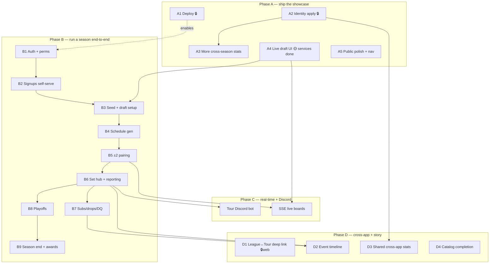

# Team Tour — Product Roadmap (refined)

## Context

`apps/tour` is the Pizza Power **Team Tour** web app — a monorepo sibling of the live
league (`web/` + `src/`). It currently is a **complete, locally-running history/stats
showcase** plus a **scaffolded write-side**. The owner's end-state is the **system that
actually runs Team Tour seasons** (signup → draft → ±2 pairing → schedule → results →
playoffs), replacing the spreadsheets, **plus** the public showcase.

This file is the **refined execution roadmap** layered on top of `apps/tour/HANDOFF.md`
(start-here state) and `docs/team-tour-design.md` (deep design). It corrects a few
inaccuracies found by reading the code, marks what is owner-blocked vs. codeable, and
sequences the work so the dependency order is explicit. Each numbered item below is sized
to be its own PR.

**Status legend:** ✅ built · 🟡 partial/scaffolded · ⬜ not started · 🔒 owner-blocked
(needs Railway/DNS/real-DB provisioning — not codeable in a normal session).

---

## Verified current state (corrections to HANDOFF)

Read directly from the code on 2026-06-26:

- **A4 is closer than it sounds.** `lib/services/draft.ts` already exports **`getDraft`
  (L125), `makePick` (L179), and `materializeRosters` (L213)**. `makePick` already flips
  the draft to `DONE` and calls `materializeRosters` on the last pick, so the live board is
  genuinely a thin shell over finished services. The *only* real A4 gaps are:
  1. **`makePickAction`** in `app/admin/seasons/[name]/draft/actions.ts` (file exists with
     only `setupDraftAction`/`resetDraftAction` — confirmed).
  2. **`app/admin/seasons/[name]/draft/page.tsx`** (does not exist — the route dir holds
     only `actions.ts`).
- **Season hub stage gating** (`app/admin/seasons/[name]/page.tsx`) hard-codes
  `draft.ready = false`; finishing A4 means flipping that to `ready: !!season.draft` (or
  state-based) so the card links out.
- **Two `export-league-players.mjs` exist** (`scripts/` and `web/scripts/`) — reconcile is
  real (cleanup item C2).
- **`TOUR_POLICY`** lives in `packages/match-core/src/match-state.ts:84` and is referenced
  only by `match-state.test.ts` — safe to delete with its test block (C1).

---

## Locked constraints (HOW everything gets built)

Settled in design §0/§10/§13; every item must respect them:

- **Web-first**; Discord = identity + notifications + match execution.
- **Derive-on-read stats** — `Game`/`TourSet` rows are the only truth; aggregates are pure
  reductions (no denormalized cache). Tiebreaker chain is a pure comparator in `tour-core`.
- **All logic in the service layer** (`apps/tour/lib/services/*`, `lib/*`), called by pages
  / server actions / API / bot. **Scripts are thin callers only.**
- **Pure domain packages** (already built + unit-tested; web/bot are thin shells):
  `match-core` (1v1 ban/pick/lives/result), `competition-core`
  (standings/format/qualify/bracket), `tour-core` (Bo-X norm, tiebreakers,
  `schedule.ts`, `draft.ts`, `pairing.ts`).
- **Real-time = SSE + Postgres `LISTEN/NOTIFY`** (no new infra).
- **Permissions**: TO/admin via Discord roles → `RoleBinding` tier; captain/player via
  season data (`TeamSeason.captainPlayerId`, approved `Signup`/`RosterEntry`).
- **Design system** is the league's, ported into `apps/tour` (Tailwind 4 + shadcn); follow
  `apps/tour/AGENTS.md`. Reuse existing components (`SubmitButton`, `ActionFlashForm`,
  `FormSelect`, `Callout`, `ConfirmButton`, `IdentityRow`, `StandingsTable`, `H2HTable`…).
- **The live league (`web/` + `src/`) stays untouched** unless explicitly approved.

---

## Dependency map (what unblocks what)

**Reading it:** A3/A4/A5 + cleanup are the only fully-codeable near-term work. A1/A2 are
owner-blocked and gate the *public* value of A3/D3 but not their code. **A4 is the linchpin
for the whole Phase B live-ops chain** (draft → roster → schedule → pairing → results).

---

## Phase A — Ship the showcase

### A1. Deploy to `tour.balatroleague.com` (hidden) 🔒
Config ready (`apps/tour/railway.json`, `start:prod`, `noindex`, `DEPLOY.md`). New Railway
service + Postgres in the league's project; Root Dir `/`, config `apps/tour/railway.json`;
shared-auth env; Discord redirect URL; domain. First boot → `prisma db push` → run the
import (Admin → Import / `/api/admin/import`). **Carry local work up:** `pg_dump` the local
`.dev-db` → restore into Railway PG so A2 isn't lost. *Owner provisions; engineer debugs
build/boot from Railway logs.*

### A2. Finish identity mapping 🔒 (tooling ✅)
Apply the 60 high-confidence auto-matches (`relink:discord -- --apply`), then use the
**Identity manager** (`/admin/identity`, `lib/services/identity.ts`) to link/merge the
rest. Outcome: `legacy:<slug>` ids → real Discord ids → `/u/[discordId]` cross-links light
up and shared stats (D3) become possible. *Needs the real DB; manual matching work.*

### A3. More cross-season stats 🟡 (codeable)
All pure derivations (design §12.7). Add loaders in `lib/` + sections on `/stats`, player,
and team pages — **reuse the patterns** in `lib/draft-stats.ts`, `lib/records.ts`,
`lib/stats.ts` (each is a pure read model over `TourSet`/`Match`/`DraftPick`):
- ✅ **Career counters** on player pages — championships/finals/playoffs made, avg seed,
  captain flag (imported `Player Stats.html` → `PlayerCareerStat`, 331 players). Seed
  differential (expected-vs-actual) still ⬜.
- ✅ **Rookie Rankings** on `/stats` (`getRookieRankings`). **Draft Classes** (by-cohort
  outcomes) still ⬜.
- ✅ **Full player-vs-player H2H matrix** — `/stats/h2h` (`getH2HMatrix`, PR-M): a colored
  most-active-16 grid alongside the per-player `H2HTable`.
- ✅ **Team career stats** — Placement + matchup W-L on `/teams` + `/teams/[id]`
  (`getTeamPlacements`, derived from standings; PR-T).
- ✅ **Captain draft grades** ("Best drafters" on `/stats`, `getCaptainDraftGrades`, PR-D):
  mean drafted-player set% vs the expected-by-round baseline. More draft-vs-match cuts ongoing.
- ⬜ Remaining: seed differential, Draft Classes by cohort, per-season finals/playoff
  breakdowns from the Counter sheets.

PR sizing: one loader + one page section per PR keeps each independently shippable.

### A4. Live **draft tool** — finish the parked UI 🟡 (services ✅ — see corrections above)
- Add **`makePickAction`** to `app/admin/seasons/[name]/draft/actions.ts` (mirror
  `setupDraftAction`: `isAdmin()` gate → `makePick(season, playerId)` → `rev(season)` →
  `ActionResult`).
- Build **`app/admin/seasons/[name]/draft/page.tsx`** over `getDraft(seasonName)`. Layout:
  reuse the historical board grid from `app/seasons/[name]/draft/page.tsx` (cards per team,
  rounds list); add the **on-the-clock** highlight (`team.onClock`), the **remaining pool**
  as a list of one-line pick forms (`<form action={makePickAction}>` + hidden
  `season`/`playerId` + `SubmitButton`), a **reset** `ConfirmButton`, and a "mark ready"
  link back to the hub. Server-rendered, no client state (matches signups pattern).
- Flip the hub's draft-stage `ready` flag in `app/admin/seasons/[name]/page.tsx`.
- Captain self-pick is already prefilled by `setupDraft` (round 1); cosmetic timer + live
  SSE + Discord pings are deferred to Phase C.

### A5. Public-facing polish (launch readiness) ⬜ (codeable; nav-into-`web/` is 🔒)
- **Landing/hub**: keep simple — two cards (League/Tour) + a Discord-id "find a player"
  search. Default placement: Tour at `tour.`, league stays apex.
- **League → Tour nav** one-liner ("Team Tour ↗") added to `web/`'s nav — **needs owner OK
  to touch `web/`.** Tour → League link already exists.
- General visual pass; flip `app/layout.tsx` `robots.index` to launch.

**Phase A exit:** showcase live (hidden), players carry real identities, stat catalog is
deep, a draft can be run on the site.

---

## Phase B — Live operations (run a season end-to-end)

Web surfaces over the existing pure engines, ordered to mirror a real season. All gated by
the season state machine (`/admin/seasons/[name]` ✅). **A4 must land first** (it produces
the rosters everything downstream reads).

- **B1. Auth + permissions go live 🟡** — set shared Discord OAuth env so `auth.ts`
  authenticates; add `RoleBinding` tier resolution (OWNER/TO/HELPER) replacing the
  `TOUR_DEV_ADMIN` bypass in `lib/auth.ts`. Captain/player gates from season data.
- **B2. Signups (self-serve) 🟡** — public signup page (Discord OAuth → form: tz,
  availability, willing-to-captain, BMP handle) writing `Signup` via
  `lib/services/signups.ts` (admin manager ✅).
- **B3. Seeding + draft setup → draft** (A4 + refinements) — refine `setupDraft` defaults
  (who's captain, conference split, self-pick round) in `lib/services/draft.ts`.
- **B4. Schedule generation ✅** — admin `/admin/seasons/[name]/schedule` over `tour-core`
  `generateSchedule` (`lib/services/schedule.ts`): per-conference round-robin into lockstep
  weeks → `Week`/`Matchup`, with a plan/setup view + week board + destructive reset.
  Special weeks (Rival/Cross-Conf/Seeded) + TO manual override still ⬜.
- **B5. Weekly ±2 pairing negotiation 🟡 (TO console ✅)** — `lib/services/pairing.ts` +
  `/admin/matchups/[matchupId]`: a TO-driven console over `tour-core` `pairing.ts` (coinflip
  send-first, propose→respond, ±2 validation, dead-end → TO override) writing PROPOSED
  `TourSet`s; state reconstructs from the persisted sets. The **live two-captain** version
  (captain auth + SSE turns) still ⬜ — layers on top once B1 + Phase C land.
- **B6. Set hub + result reporting 🟡 (TO reporting ✅)** — `lib/services/report.ts` +
  the matchup console: `reportSet` writes a canonical core `Match` (admin → CONFIRMED) and
  links the `TourSet`; `rollupMatchup` persists the team result **only when decided**, so
  derive-on-read standings count only completed matchups (matches imported seasons). Resets
  now drop linked `Match`es (no orphans). Still ⬜: a **player-facing** "what do I do this
  week" view, the **both-players-confirm** flow (needs auth), the `match-core`
  `LEAGUE_POLICY` ban/pick report path, `#results` posting, DC ruleset.

> **Milestone:** the core play loop runs on the site end-to-end —
> signups → draft → schedule → ±2 pairing → result reporting → standings. What's left in
> Phase B is the **bookends** (B8 playoffs, B9 season end) and **exceptions** (B7 subs/drops/DQ),
> plus the player-facing/live layers that need auth (B1) + real-time (Phase C).
- **B7. Subs / drops / DQ handling ✅** — new `SeasonEvent` model (audit + D2 seed) +
  `lib/services/roster-ops.ts` + `/admin/seasons/[name]/roster`. `substitute` mutates the
  lineup on a **forward** week-block (clones the prior block) so past blocks + their stat
  attribution stay intact; `recordDrop`/`recordDQ` are audit-only (each with a reason +
  actor). Per-team sub/drop forms, season DQ, and the event log feed D2.
- **B8. Playoffs ✅** — `lib/services/playoffs.ts` + `/admin/seasons/[name]/playoffs`:
  `startPlayoffs` qualifies (auto-berths + wildcards) + seeds the field and writes
  `PlayoffEntry` + the round-1 `PlayoffSeries` (`standardBracketPairings`); `reportSeries`
  records results and auto-advances winners (`advanceWinners`) QF→SF→Final to a champion.
  Added `PlayoffSeries.bracketIndex` for stable bracket order. Single-elim field of 2/4/8;
  re-seed-by-choice ceremony (§6.5) still ⬜.
- **B9. Season end ✅** — `lib/services/season-end.ts` + `/admin/seasons/[name]/end`:
  `crownChampion` writes the `Championship` from the FINAL winner → DONE (uncrown reverses);
  awards editor for all 7 kinds (player/team). `getChampionRun` is now bracket-aware (champion
  = crowned team / FINAL winner, run = the series they played) so live brackets AND historical
  champion-path imports both resolve. Rolling to the next season is manual (create-season ✅).

> **Phase B admin side COMPLETE:** the full season lifecycle runs on the site end-to-end —
> signups → draft → schedule → ±2 pairing → reporting → standings → roster ops (subs/drops/DQ)
> → playoffs → champion → awards → DONE. No spreadsheet. What remains is the
> **player-facing/live layers** — self-serve signups (B2), the player "what do I do this week"
> view + both-player confirm (B6), and the live two-captain pairing (B5) — all gated on **B1
> auth** (Discord OAuth env) + **Phase C** real-time (SSE). Plus the public showcase of live
> data (a public bracket/standings render).

---

## Phase C — Real-time + Discord depth

- **SSE + `LISTEN/NOTIFY` live boards**: draft (`draft:<seasonId>`), pairing
  (`pairing:<matchupId>`), standings (`standings:<seasonId>`). Optimistic POST → write →
  NOTIFY → re-render.
- **Tour Discord bot** (own token, new Railway service): match-execution thread (ban/pick →
  report → confirm → NOTIFY), `#results`/`#schedule` bootstrap, role provisioning (mirror
  data → cosmetic `playerRoleId`/`captainRoleId`), pings/nudges (on-the-clock, Sunday
  deadline, awkward-tz alert per design §14.4).

---

## Phase D — Cross-app integration + the "story" layer

- **D1. League ↔ Tour deep link 🔒(web)** — league-side `/u/[discordId]` mirror + return
  nav link (touches `web/`).
- **D2. Event timeline ⬜** — scrollable week-by-week season feed (draft done, subs, drops,
  DQs, results, standings shifts) derived from `Week`/`Matchup`/`TourSet` status + the
  sub/drop/DQ audit (B7). Flagship "season story" surface.
- **D3. Shared cross-app stats ⬜** — hub-level combined league+tour player view joined by
  `discordId`. Tour can already read the league DB
  (`web/scripts/export-league-players.mjs`); a cross-DB read service + "all-Balatro"
  profile/leaderboard. **Deferred until A2 identities are mapped.**
  - **D3a. BMP MMR on Tour profiles (headline feature).** The league's
    `PlayerMmrSnapshot` already stores, per BMP season (season1–6 today; 189 players,
    9.3k snapshots): `rankedMmr` (finishing/current), **`peakMmr`**, `wins`/`losses`
    (→ win%), `rankedTier`, `leaderboardRank`, over time. Surface on
    `/players/[id]`: current + last-season MMR, and a per-BMP-season row (finishing +
    peak MMR, win%, tier). Reuse league helpers (`web/lib/bmp-snapshots.ts`
    `byBestBmpSnapshot`). **Gated on:** A2 (identities — `discordId` is the join) +
    a runtime read connection to the league DB (`LEAGUE_DATABASE_URL`), via a second
    Prisma client/raw query in `apps/tour/lib/services/league-mmr.ts`.
- **D4. Cross-season catalog completion ⬜** — championship-run narratives, Hall-of-Fame
  depth, the remaining 6 awards (needs a **cleaned `Awards.html`** — current sheet
  column-drifts; do not auto-parse blind).

---

## Cross-cutting cleanup (low effort, do alongside)

- **C1. Delete dead `match-core` `TOUR_POLICY`** (`packages/match-core/src/match-state.ts:84`)
  + its `match-state.test.ts` references. Team Tour uses the league's `LEAGUE_POLICY`
  (already `DEFAULT_POLICY`). Optionally trim `tour-core` `TOUR_TIEBREAKERS` 5→3 levels
  (owner call; the extra 2 are reasonable fallbacks — leave unless owner says otherwise).
- **C2. Reconcile the two `export-league-players.mjs`** (`scripts/` vs `web/scripts/`) →
  keep one (the `scripts/` copy writes to `apps/tour/` + usernames; fold in the
  `web/scripts/` snowflake filter).

---

## Critical files / building blocks to reuse

- **Engines (don't reinvent):** `packages/tour-core/src/{schedule,draft,pairing,bo-x,standings}.ts`,
  `packages/competition-core/src/*` (`qualify`, `standardBracketPairings`, tiebreakers),
  `packages/match-core/src/{match-state,result,match-write}.ts`.
- **Services:** `apps/tour/lib/services/{import,seasons,signups,draft,identity}.ts`.
- **Read models:** `apps/tour/lib/{stats,team,standings,playoffs,playoff-picture,draft-history,draft-stats,records,awards,home,champions}.ts`.
- **UI kit:** `apps/tour/components/{ui/*,SubmitButton,ConfirmButton,ActionFlashForm,FlashToast,FormSelect,Callout,IdentityRow,StandingsTable,H2HTable,SetPctChart,CommandPalette}.tsx`.
- **Schema:** `apps/tour/prisma/schema/{core,tour}.prisma`.
- **Deploy:** `apps/tour/{railway.json,DEPLOY.md}`.

---

## Verification (per phase)

- **Every change:** `cd apps/tour && npx tsc --noEmit` clean; `npm test` in the touched
  package (keep engines green).
- **Data/service changes:** exercise the service directly via a throwaway `tsx` script —
  **don't** trust dev-server HTML greps (RSC stream + React comment markers lie; HANDOFF §7).
- **Pages:** `curl` each route for 200 against `localhost:4000`; spot-check content. Run
  with the **dev server stopped** for any `npm install` / big `globals.css` change (wipe
  `.next` + restart — HANDOFF §7 lock-race + stale-CSS gotcha).
- **A4 specifically:** on a scratch season — create → add+approve ≥2 captains + a pool →
  `setupDraft` → open the board → make picks through the snake order → assert last pick
  flips `Draft.state=DONE` and `materializeRosters` wrote `Roster`/`RosterEntry`; confirm
  the public team/draft pages render the new rosters.
- **Live-ops flows (Phase B):** run a synthetic season end-to-end on a scratch DB
  (season → signups → draft → schedule → pair → report+confirm → standings → playoffs →
  champion), asserting derived stats match.
- **Deploy (A1):** Railway build green (`npm ci` at root links workspaces), boot applies
  schema, import populates, a route returns 200 behind the domain.

---

## Open questions (not blocking)

- Does the **apex** eventually become a neutral landing (league → `league.`) or stay the
  league? (Affects D1/A5; default keeps league at apex.)
- **Awards**: hand-enter the 6 messy ones via an admin form, or clean the sheet first?
- **Profile consolidation** (one merged profile) vs. the cross-links we have — deferred;
  `discordId` keeps it possible anytime.
